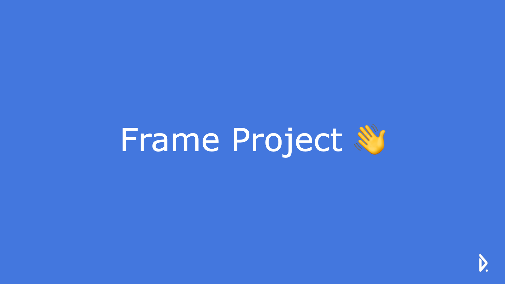

# devent-frame-v2
노드 기반 템플릿 프로젝트

## 요약

프레임 프로젝트는 데벤트의 코드 표준화를 위해 설계되었습니다. 기본 회원가입 기능과 로그인 기능, 데이터베이스 연결 로직, 피드 CRUD, 테스트 코드가 기본적으로 개발되어 있습니다.  


## 실행

**의존성 설치**

```
npm install
```
**실행**

```
npm run start
```
**테스트**

```
npm run test
```
